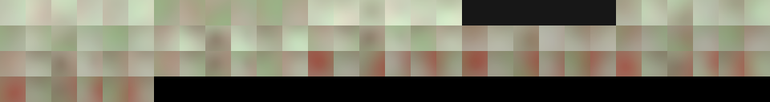
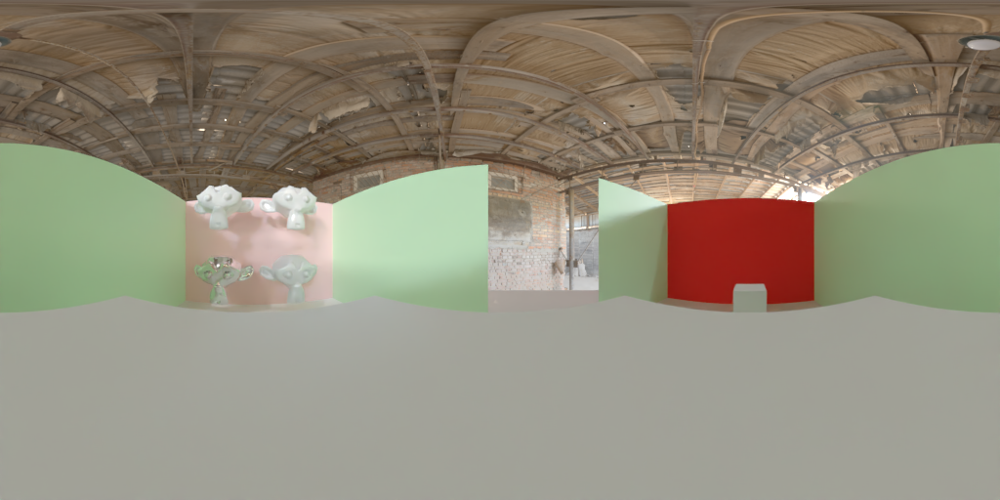

# Blender GI Bake

GI Bake is blender a plugin which precompute scene global illumination and export data as texture and json file. This includes :
- multi roughness level radiance cubemaps based on blender eevee cubemap probes
- irradiance cubemaps based on blender eevee irradiance probes
- baked material lightmap based on blender bake system


**TBD**: All Mesh Objects are by default rendered the first phase but can be ignored (eg. Dynamic object) using a custom rendered option in object probe export (TODO: integrate a switch in object structure panel if possible)

## Integration example

A three js demo app is available here [https://three-probes.dotify.eu/](https://three-probes.dotify.eu/) and source code is available [here](https://github.com/gillesboisson/threejs-probes-test). It support only debugging and probes interpolation, its final goal as three extension is to support baked scene rendering (probes, baked objects, dynamic objects).


## Probes

Probes export is done in 2 phases
- Rendering : use Blender cycle engine tu render probes
- Packing  : use Blender opengl API to compute irradiance and reflectance and pack data in texture sheet

### Rendering

Rendering phase Use blender cycle renderer to render scene static object in reflectance cubemaps and panomic equi rectangle for each Irradiance Grid cell, final result is a png (HDR not supported yet) images for each probe


#### Visibility

Each probes volumes has visibility settings to define which objects collection are renderer, it is based on existing blender engine features. By default all object are visible but it can be changed in object probe export panel.

Each scene object has a custom visibility options (1 per probe volume type). It allows to define which objects are rendered. This work in unions (&) with probe volume collection visibility settings.

All rendered objects are exported in probe baked_objects property

### Compute and Packing

Cumpute phase  load renderered image into blender and use internal blender openGL API to compute irradiance, create reflectance level and pack final data in textures sheet for fast integration. Data are exported as JSON and PNG texture sheet, one for each probe

Irradiance computing is based on Diffuse Irradiance Volume opengl implementation from  [Learn OpenGL](https://learnopengl.com/PBR/IBL/Diffuse-irradiance) implementation.

Radiance computing is based on IBL Volume implementation from [Learn OpenGL](https://learnopengl.com/PBR/IBL/Specular-IBL) implementation.

Global environment map is based on a mix of both algorithm.

### Probes image format

2 format are used for probes data

#### HDR : Open EXR
16Bits per channel HDR image are used for rendering and packed data
Rendered and packed as open exr (mono layer) file

#### SDR : PNG
8Bits per channel SDR image are used for rendering and packed data
Rendered and packed as png file with global exposure settings

### Scene probes data

#### File structure

Scene probes data are exported in a folder defined by user, in scene probes export panel.

- export_directory
    - probes.json
    - reflection_1_packed.exr
    - irradiance_2_packed.exr
    - Global_probe.exr
    - probes.json
    - __render_cache                    : cache folder for rendered / packed probes
        - reflection_1                  : per probe folder
            - 0_0_0.exr                 
            - 1_0_0.exr                 
            - ...
            - packed_probe.json         : packed probe data (use as cache data)
            - rendered_probe.json       : rendered probe data (use as cache data)

        - irradiance_2                  : per probe folder
            - pano.exr                  : per probe equirectangle is baked
            - packed_probe.json         : (use as cache data)
            - rendered_probe.json       : (use as cache data)
        - Global_probe                  : fix name
            - Global probe.exr           : renderer panorama
            - packed_probe.json         : (use as cache data)
            - rendered_probe.json       : (use as cache data)
            

#### image

Baked example is based on [this scene](./doc/example-scenes/baking-probs.blend)


##### Irradiance

For each irradiance grid cell, a panoramic equirectangle is baked and saved in a image file


Final packed data is saved in a image file



##### Reflection

For each radiance probe, a panoramic equirectangle is baked and saved in a image file



Final packed data is saved in a image file with all roughness level


##### Global environment

Global environment is a global probe which render pano and pack irradiance and radiance data in separate files.

It use the same irradiance and radiance algorithm as other probes but with global settings define in render settings panel

TODO: create custom blender objet rather using reflectance probe
It can be define through a blender radiance cubemap with Use as global probe environment option checked 

#### Data structure

Scene probes data are exported as JSON and includes all probes attributes and a link to data texture
Rendered probes attributed are saved in a json file (probes.json) with a commmon main structure and sub data property with specific probe type based settings


**Structure**

```json

{
    // Common settings ======================================================================
    "name": "Global probe",
    "probe_type": "global", // global | irradiance | reflection
    "transform": {
        "position": [
            0.0,
            5.0,
            -0.0
        ],
        "scale": [
            1.0,
            1.0,
            1.0
        ],
        "rotation": [   // euler rotation
            0,
            0,
            0
        ]
    },

    // Render settings
    "render": {
        "clip_start": 0.800000011920929,
        "clip_end": 80.0,
        "map_size": 128,    // height of panorama (width is 2 * height)

        // specific blender cyvle settings
        "cycle_samples_max": 32,
        "cycle_samples_min": 1,
        "cycle_time_limit": 5
    },

    // names of objects rendered in probes
    "baked_objects": [
        "pillar NE",
        "pillar SE",
        "pillar SW",
        "pillar NW"
    ],
    // Specific settings ======================================================================
    "baking":{}, // probe volume compositing settings 
    "data":{} // probe data exported settings
},

```

**Reflection**

```json
{
    "name": "ReflectionCubemap S",
    "probe_type": "reflection",
    "transform": {
       // ...
    },
    "render": {
        // ...
    },
    "baked_objects": [
       // ...
    ],

    "data": {
        
        // Influence type "BOX" | "ELLIPSOID"
        "influence_type": "BOX",

        // Influence distance
        "influence_distance": 0.30000007152557373,
        
        // Volume falloff distance
        "falloff": 1.0,

        // Probe intensity (relative to overlayed volumes)
        "intensity": 1.0,
    },
    "file": "ReflectionCubemap S_packed.exr",
    "baking": {

        // cubemap face size : 
        //   reflection baked texture has 4 face on first row and 2 faces on second row
        //   sub level mipmaps are packed in bottom right corner of texture
        //   final texture width is 4 x cubemap_face_size
        //   final texture height is 2 x cubemap_face_size
        "cubemap_face_size": 128, 

        // roughness level settings (eg. 4 levels with 0.1 start roughness and 0.2 roughness increment > 0.1, 0.3, 0.5, 0.7 )
        "start_roughness": 0.1,
        "level_roughness": 0.2,
        "nb_levels": 4
    }
}
```

**Irradiance**
```json
{
    "name": "IrradianceVolume H",
    "probe_type": "irradiance",
    "transform": {
        // ...
    },
    "render": {
        // ...
    },
    "baked_objects": [
        // ...
    ],

    // baked texture file name
    "file": "IrradianceVolume H_packed.exr",
    "data": {
        // grid resolution
        "resolution": [
            2,
            2,
            2
        ],

        // Influence distance
        "influence_distance": 0.30000007152557373,
        
        // Volume falloff distance
        "falloff": 1.0,

        // Probe intensity (relative to overlayed volumes)
        "intensity": 1.0,
    },
    "baking": {
        // baked cubemap facesize 
        "cubemap_face_size": 128,

        // baked texture max width 
        // based on irradiance texture layout cubemap faces are packed in one row of 6 faces : 6 x cubemap_face_size (eg. 128 * 6 = 768)
        // max_texture_size has to be a multiple of cubemap_face_size x 6 (eg. 128 x 6 x 2 = 1536 > 2 cubes per rows)
        "max_texture_size": 1536
    },
    
}
```


**Global**
```json
{
    "name": "Global probe",
    "probe_type": "global",
    "transform": {
        // ...
    },
    "render": {
        // ...
    },
    "data": {},
    "baked_objects": [
    // ...
    ],

    // baked texture file names
    "irradiance_file": "Global probe_irradiance_packed.exr",
    "reflectance_file": "Global probe_radiance_packed.exr",
    
    "baking": {
        // irradiance baking settings (same as irradiance volume baking settings)
        "irradiance": {
            "cubemap_face_size": 32,
            "max_texture_size": 960
        },
        // radiance baking settings (same as reflection volume baking settings)
        "reflectance": {
            "cubemap_face_size": 128,
            "max_texture_size": 1024,
            "start_roughness": 0.10000000149011612,
            "level_roughness": 0.20000000298023224,
            "nb_levels": 1
        }
    },
}
```


## Lightmap baking TBD

Baking phase use blender bake system to bake material lightmap as blender images

Material baking is done on 2 phases
- Baking material lightmap (complete or indirect only) into images
- Denoising baked images

## Roadmap

This plugin is in its development phase, here is the list of milestones ordered by priority 
- [ ] Probes 
    - [X] Irradiance probe render operator
    - [X] Reflectance probe render operator
    - [X] Object probe baking settings 
    - [X] Complete scene Render operator
    - [X] Irradiance Cubemap packing
    - [X] Refletance Cubemap packing
    - [X] HDR / SDR format Support
    - [X] Global environment map baking
    - [ ] SH irradiance packing (WebGL / ThreeJS instance rendering issue with cubemap)
    - [ ] Radiance pano packing (WebGL / ThreeJS instance rendering issue with cubemap)

- [ ] lightmap baking
    - [ ] Per material baking support
    - [ ] Baked material generator
    - [ ] Bake material operator
    - [ ] GPU based denoiser
    - [ ] Material exported data definition
    - [ ] Material data packing

- [ ] Probes and lightmap merge
    - [ ] Common approach for static / dynamic objects (mesh, lights) definition between probes and lightmap and visibility setup
    - [ ] Common data schema for probes and lightmap

- [ ] Back burner features 
    - [x] Improve UI,Asynchronous rendering, probes cache handling 
    - [ ] Blender headless python command
    - [ ] Support of other data kind using blender bake system (eg. Ambiant occlusion)

### Bugs
- wrong progress percentage on render debug


## License

The MIT License (MIT)

Copyright (c) 2023-present Gilles Boisson

Permission is hereby granted, free of charge, to any person obtaining a copy
of this software and associated documentation files (the "Software"), to deal
in the Software without restriction, including without limitation the rights
to use, copy, modify, merge, publish, distribute, sublicense, and/or sell
copies of the Software, and to permit persons to whom the Software is
furnished to do so, subject to the following conditions:

The above copyright notice and this permission notice shall be included in all
copies or substantial portions of the Software.

THE SOFTWARE IS PROVIDED "AS IS", WITHOUT WARRANTY OF ANY KIND, EXPRESS OR
IMPLIED, INCLUDING BUT NOT LIMITED TO THE WARRANTIES OF MERCHANTABILITY,
FITNESS FOR A PARTICULAR PURPOSE AND NONINFRINGEMENT. IN NO EVENT SHALL THE
AUTHORS OR COPYRIGHT HOLDERS BE LIABLE FOR ANY CLAIM, DAMAGES OR OTHER
LIABILITY, WHETHER IN AN ACTION OF CONTRACT, TORT OR OTHERWISE, ARISING FROM,
OUT OF OR IN CONNECTION WITH THE SOFTWARE OR THE USE OR OTHER DEALINGS IN THE
SOFTWARE.
