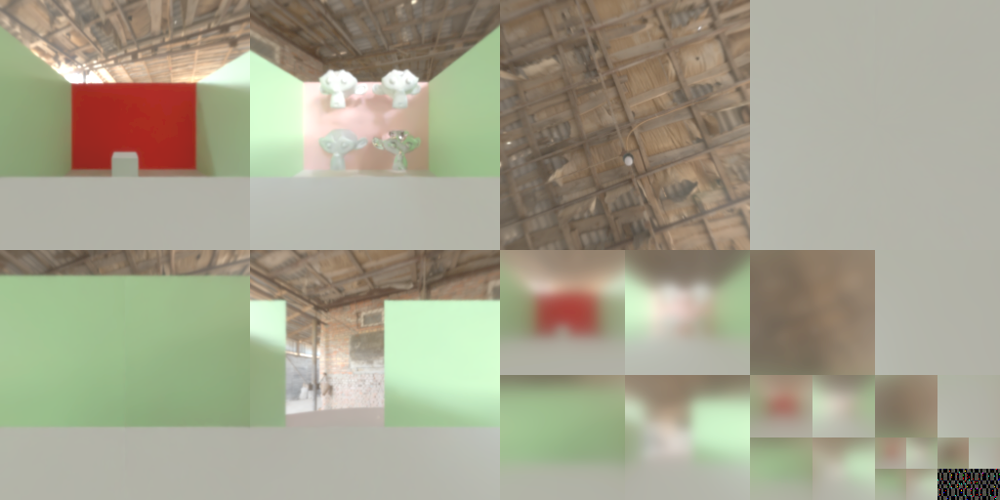

# Blender probes export

Blender probes is blender plugin allowing to precompute reflectance, indirect luminance from blender and export data for use in external engine. It is based on blender probes object (reflection cubemap and irradiance grid) which has been design for blender eevee internal engine but not allowing baked data export.

Probe export is done in 2 phases
- Rendering : use Blender cycle engine tu render probes
- Packing  : use Blender opengl API to compute irradiance and reflectance and pack data in texture sheet

All Mesh Objects are by default rendered the first phase but can be ignored (eg. Dynamic object) using a custom rendered option in object probe export (TODO: integrate a switch in object structure panel if possible)

### Rendering

Rendering phase Use blender cycle renderer to render scene static object in reflectance cubemaps and panomic equi rectangle for each Irradiance Grid cell, final result is a png (HDR not supported yet) images for each probe

#### Visibility

Each probes volumes has visibility settings to define which objects collection are renderer, it is based on existing blender engine features. By default all object are visible but it can be changed in object probe export panel.

Each scene object has a custom visibility options (1 per probe volume type). It allows to define which objects are rendered. This work in unions (&) with probe volume collection visibility settings.

All rendered objects are exported in probe baked_objects property

### Compute and Packing

Cumpute phase  load renderered image into blender and use internal blender openGL API to compute irradiance, create reflectance level and pack final data in textures sheet for fast integration. Data are exported as JSON and PNG texture sheet, one for each probe

Irradiance computing is based on Diffuse Irradiance Volume opengl implementation from  [https://learnopengl.com/PBR/IBL/Diffuse-irradiance](Learn OpenGL).

Reflection computing is based on IBL Volume implementation from [https://learnopengl.com/PBR/IBL/Specular-IBL](Learn OpenGL) implementation.

Global environment map is based on a mix of both algorithm.

### Probes image format

2 format are used for probes data

#### HDR : Open EXR
16Bits per channel HDR image are used for rendering and packed data
Rendered and packed as open exr (mono layer) file

### SDR : PNG
8Bits per channel SDR image are used for rendering and packed data
Rendered and packed as png file with global exposure settings

### Scene probes data

#### File structure

Scene probes data are exported in a folder defined by user, in scene probes export panel.

- export_directory
    - probes.json
    - reflection_1_packed.png
    - irradiance_2_packed.png
    - global_pano.hdr
    - probes.json
    - __render_cache                    : cache folder for rendered / packed probes
        - reflection_1                  : per probe folder
            - 0_0_0.png                 
            - 1_0_0.png                 
            - ...
            - packed_probe.json         : packed probe data (use as cache data)
            - rendered_probe.json       : rendered probe data (use as cache data)

        - irradiance_2                  : per probe folder
            - pano.png                  : per probe equirectangle is baked
            - packed_probe.json         : (use as cache data)
            - rendered_probe.json       : (use as cache data)
        - Global probe                  : fix name
            - global_pano.hdr           : renderer panorama
            - packed_probe.json         : (use as cache data)
            - rendered_probe.json       : (use as cache data)
            

#### image

Baked example is based on [this scene](./doc/example-scenes/baking-probs.blend)


##### Irradiance

For each irradiance grid cell, a panoramic equirectangle is baked and saved in a png file


Final packed data is saved in a png file


##### Reflection

For each reflection probe, a panoramic equirectangle is baked and saved in a png file


Final packed data is saved in a png file with all roughness level



##### Global environment

A global environment map is also baked and saved in hdr file

TODO: create custom blender objet
It can be define through a blender reflection cubemap with Use as global probe environment option checked 

#### Data structure

Scene probes data are exported as JSON and includes all probes attributes and a link to data texture
Rendered probes attributed are saved in a json file (probes.json) with a commmon main structure and sub data property with specific probe type based settings

```json
[
    // Global
    {
        "type": "global",
        "position": [
            0.0,
            5.0,
            -0.0
        ],
        "clip_start": 0.800000011920929,
        "clip_end": 80.0,
        "file": "Global probe.png"
    },
    // Irradiance
    {
        "name": "IrradianceVolume N",
        "file": "IrradianceVolume N_packed.png",
        "cubemap_size": 64,
        "texture_size": 2048,
        "type": "irradiance",
        "position": [
            0.0,
            5.0,
            -7.051239490509033
        ],
        "scale": [
            14.094822883605957,
            6.012429237365723,
            6.948479175567627
        ],
        "clip_start": 0.0010000000474974513,
        "clip_end": 20.0,
        "baked_objects": [
            "east-wall",
            "floor",
            "north-int-wall",
            "north-wall",
            "south-int-wall",
            "south-wall",
            "west-cube.001",
            "west-cube.002",
            "Suzanne",
            "Suzanne.001",
            "Suzanne.002",
            "Suzanne.003",
            "west--wall",
            "west-cube",
            "pillar NE",
            "pillar SE",
            "pillar SW",
            "pillar NW"
        ],
        "data": {
            "falloff": 1.0,
            "resolution": [
                4,
                2,
                2
            ],
            "influence_distance": 0.20000004768371582
        }
    },

    // Reflection
    {
        "name": "ReflectionCubemap N",
        "file": "ReflectionCubemap N_packed.png",
        "cubemap_size": 256,
        "texture_size": 2048,
        "type": "reflection",
        "position": [
            0.0,
            5.0,
            -8.0
        ],
        "scale": [
            1.0,
            1.0,
            1.0
        ],
        "baked_objects": [
            "east-wall",
            "floor",
            "north-int-wall",
            "north-wall",
            "south-int-wall",
            "south-wall",
            "west-cube.001",
            "west-cube.002",
            "Suzanne",
            "Suzanne.001",
            "Suzanne.002",
            "Suzanne.003",
            "west--wall",
            "west-cube",
            "pillar NE",
            "pillar SE",
            "pillar SW",
            "pillar NW"
        ],
        "clip_start": 0.800000011920929,
        "clip_end": 20.0,
        "data": {
            "start_roughness": 0.05000000074505806,
            "level_roughness": 0.800000011920929,
            "end_roughness": 3.250000048428774,
            "nb_levels": 4,
            "scale": [
                1.0,
                1.0,
                1.0
            ],
            "falloff": 0.3314814865589142,
            "influence_distance": 9.0,
            "intensity": 1.0,
            "influence_type": "ELIPSOID"
        }
    },
]
```


### Progress

This plugin is in its development phase, here is the list of milestones ordered by priority 

- [X] Irradiance probe render operator
- [X] Reflectance probe render operator
- [X] Object probe baking settings 
- [X] Complete scene Render operator
- [X] Irradiance Cubemap packing
- [X] Refletance Cubemap packing
- [X] HDR / SDR format Support
- [ ] Global environment map baking : In progress (see [Global environment](#global-environment))
- [ ] SH irradiance packing
- [ ] Asynchronous rendering + progress bar
- [ ] Blender headless python command
- [ ] Support of other data kind using blender bake system (eg. Ambiant occlusion)


## License

The MIT License (MIT)

Copyright (c) 2023-present Gilles Boisson

Permission is hereby granted, free of charge, to any person obtaining a copy
of this software and associated documentation files (the "Software"), to deal
in the Software without restriction, including without limitation the rights
to use, copy, modify, merge, publish, distribute, sublicense, and/or sell
copies of the Software, and to permit persons to whom the Software is
furnished to do so, subject to the following conditions:

The above copyright notice and this permission notice shall be included in all
copies or substantial portions of the Software.

THE SOFTWARE IS PROVIDED "AS IS", WITHOUT WARRANTY OF ANY KIND, EXPRESS OR
IMPLIED, INCLUDING BUT NOT LIMITED TO THE WARRANTIES OF MERCHANTABILITY,
FITNESS FOR A PARTICULAR PURPOSE AND NONINFRINGEMENT. IN NO EVENT SHALL THE
AUTHORS OR COPYRIGHT HOLDERS BE LIABLE FOR ANY CLAIM, DAMAGES OR OTHER
LIABILITY, WHETHER IN AN ACTION OF CONTRACT, TORT OR OTHERWISE, ARISING FROM,
OUT OF OR IN CONNECTION WITH THE SOFTWARE OR THE USE OR OTHER DEALINGS IN THE
SOFTWARE.
